Dynamics 365 SidePanel Tools
============================

## Summary

- [Introduction](#introduction)
- [Available Tools](#available-tools)
    - [Main Menu](#main-menu)
    - [Form Tools](#1-form-tools)
    - [Update Records](#2-update-records)
    - [All Attributes](#3-all-attributes)
    - [Option Set Tables](#4-option-set-tables)
    - [Dirty Fields](#5-dirty-fields)
    - [Related Records](#6-related-records)
    - [WebResources Editor](#7-webresources-editor)
    - [Impersonation](#8-impersonation)
    - [Plugin Trace Logs Exporer](#9-plugin-trace-logs-explorer)
    - [Navigation](#10-navigation)
    - [Command Checker](#11-command-checker)
    - [Configuration Manager](#12-configuration-manager)
- [Contribution](#contribution)
- [Licence](#licence)

# Introduction

The Dynamics 365 SidePanel Tools extension provides a powerful set of utilities that can enhance your productivity. This chromium extension adds a panel to the right side of Dynamics 365 pages, giving you easy access to a variety of tools that can display useful informations or edit data. These tools are designed to be user-friendly and can be opened independently.

A configuration tool is available to customize the extension's loading settings.

# Available Tools

## Main Menu
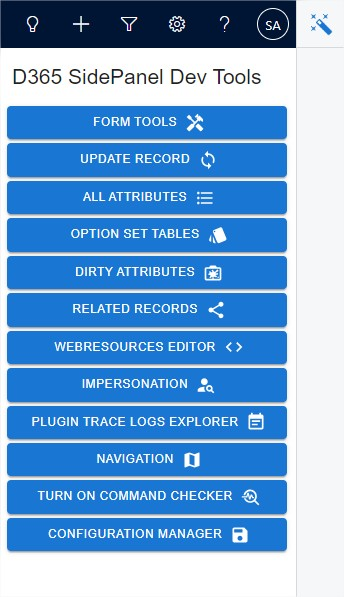

The main menu can be opened or closed by clicking on the magic wand. The displayed button are used to open the corresponding tools describes below.

## 1\. Form Tools
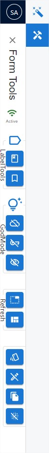

Randomize, visualize, and master your data.

This tool provide functionnalities used on records form. Each button are reversible : it can be activated or deactivated without refreshing the page.

1. Label Tools: `Display or hide logical names next to field names. Logical names can be clicked to be copied.`
   * Show/Hide Tab and Section logical names
   * Show/Hide Field and Grid logical names
2. God Mode: `Change field configurations or restore default configurations.`
   * Mark all fields optionnal
   * Enable all fields
   * Set all fields visible
3. Refresh
   * Refresh Ribbon: `Reload ribbon`
   * Refresh fields data: `Reload form data`
4. Show option set values in fields: `Display option set values in option labels`
5. Fill fields with randomized data: `Allow to generate random data using different methods`
   * Enable Fill on Click: `Allow to set random data in clicked fields. Can be deactivated.`
   * Fill Mandatory fields: `Set random data in all mandatory fields on the form.`
   * Fill BPF fields: `Set random data in all fields on the Business Process Flow.`
   * Fill All fields: `Set random data in all fields on the form.`
   * Clear all fields: `Set empty in all fields on the form.`
   * Restore original values: `Allow you to rollback the fields data to the state at the form loading`
7. Clone the current record: `Open a dialog with a record duplicating the data of the current record. The open record is not saved at this state`
8. Blur data: `Blur fields and grids data. This button can be used on Homepage grids.`

## 2\. Update Records
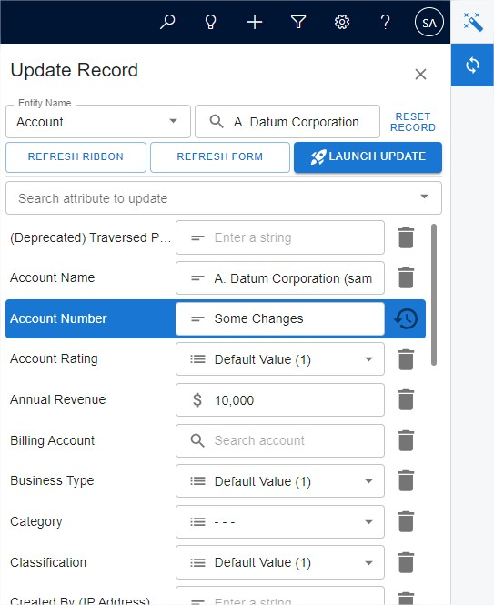

With this tool, you can update any field of any record on your environment. You can even update multiple records at once for bulk updates.

The default record loaded is the currently opened record. You can select different entity and records using the input fields at the top.

To update a field, select it from the dropdown menu. Then, enter a new value in the corresponding input field. You can always restore the original value if needed.

To remove a field from the update list, click the trash bin icon.

Each field type has a matching input type, such as a text box for text fields or a date picker for date fields. Input fields have an icon that you can click to open a tool that helps with data entry.

## 3\. All Attributes
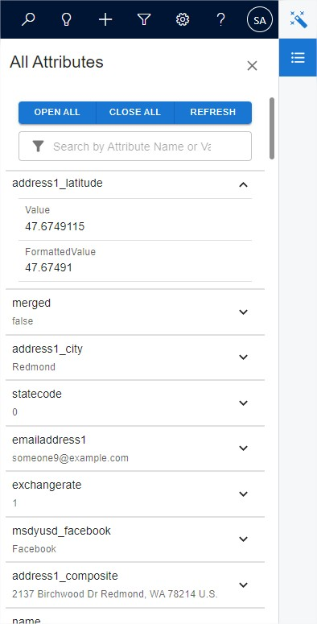

See every field, every value, all in one place.

This tool provides a convenient way to quickly access and review all the data of your open record.

It displays all the fields and values of the currently open records.

Expand the box to reveal additional values from the WebApi, such as the _FormattedValue_.

## 4\. Option Set Tables
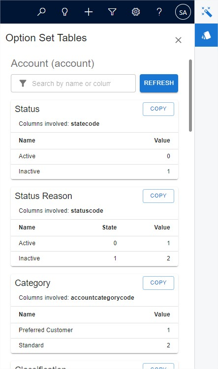

See every option set, every label, every value.

This tool offers a quick way to view all option sets associated with the currently open entity.

Each table displays all option labels and values for every available option set on the entity. You'll also find the list of fields that utilize it.

You can copy labels or values by simply clicking on them. Alternatively, you can copy the entire table to your clipboard.

## 5\. Dirty Fields
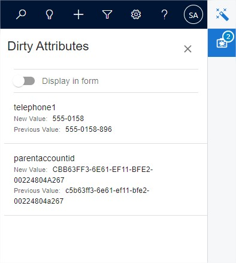

See your unsaved changes at a glance, and easily navigate to them with a click.

This tool displays the fields that have been changed but not yet saved.

By clicking on the box, you can trigger the focus of the fields on the form. This can even be on a different tab.

You can also enable an option to display a red box around the field controls on the form, making them visually stand out.

## 6\. Related Records
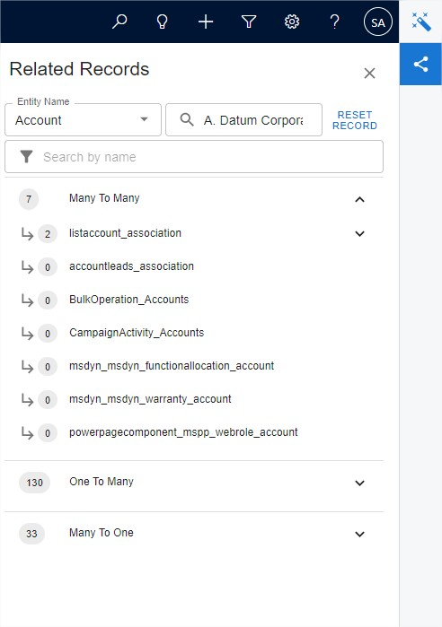

Explore entity relationships and related records.

This tool displays all relationships associated with the selected entity. It also lists related records for the selected record.

To view a record in detail, click on it to open a dialog. Alternatively, you can access a contextual menu (right-click) for other opening options.

## 7\. WebResources Editor
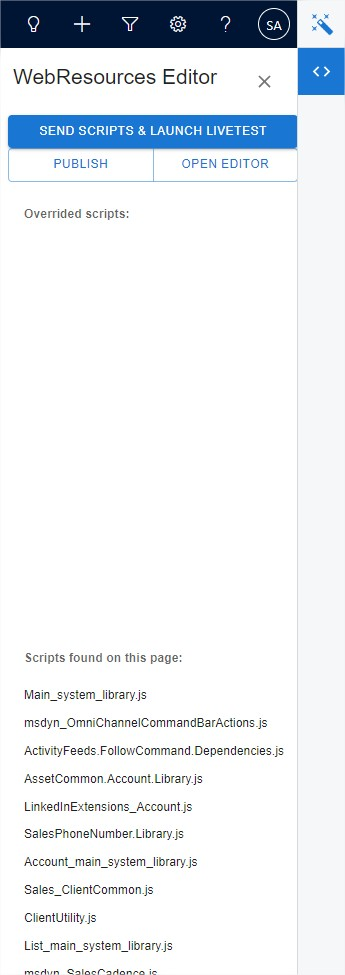

Edit, test, and publish - all within your browser!

This tool adds an editor directly to your browser, allowing you to modify web resources with ease. No more tedious updates or deployments! You can test your changes live in local, seeing the results instantly.

Here's how it works:

1. **Edit**: `Modify any loaded file on the current page using the Monaco Editor, the same robust code editor that powers VS Code.`
2. **Live Test**: `After saving your changes, enable live testing. This reloads your page in debug mode, allowing your edited scripts to override the originals.`
3. **Publish**: `Once you're satisfied with your modifications, publish the files to make them permanent.`

## 8\. Impersonation
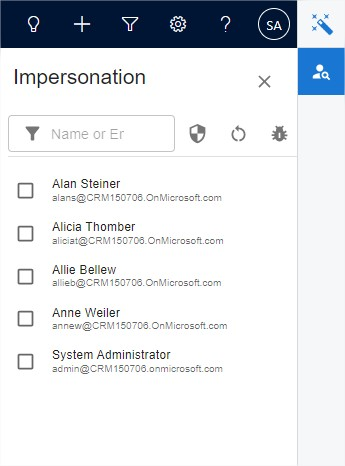

Empower yourself with the ability to impersonate any user on your environment.

The user list is :
* Online: `Enabled users with valid licenses associated with a security role`
* OnPremise: `Enabled users associated with a security role`

You can filter the list by name, email address and even with security roles.

You can also check each user's security by hovering over their entry in the list.

## 9\. Plugin Trace Logs Explorer

Tired of sifting through cluttered and unoptimized log lists?

The Plugin Trace Logs Explorer provides a streamlined way to view and analyze logs for plugins and custom workflows. Enjoy:
* **Enhanced Information**: `Access detailed log information with a clear and easy-to-read layout.`
* **Efficient Filtering**: `Quickly find the logs you need by filtering by involved entity, message name, and date range.`
* **Log Correlation**: `After selecting a log, explore the correlation — a view of all related processes, both before and after the selected log.`

## 10\. Navigation
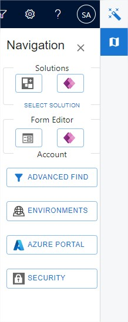

This tool provides quick access to various essential resources:
* **Solutions**: `Opens the solution list or the selected solution in an other tab. Choose between the classic interface or PowerApps.`
* **Form Editor**: `Opens the form editor of the currently opened form in an other tab. Choose between the classic interface or PowerApps.`
* **Advanced Find**: `Opens the good old Advanced Find in a new tab, automatically focusing on the currently viewed entity.`
* **Environments**: `Opens the environment list of the tenant on admin center.`
* **Azure Portal**: `Opens the tenant's Azure portal.`
* **Security**: `Opens the classic interface security page of the advanced settings.`

## 11\. Command Checker
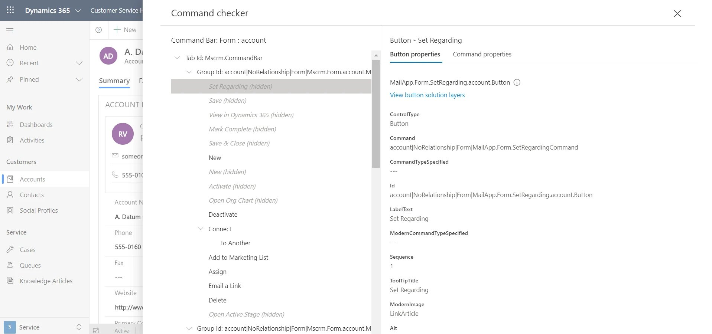

This button enable or disable the debugger for model-app ribbons.

## 12. Configuration Manager
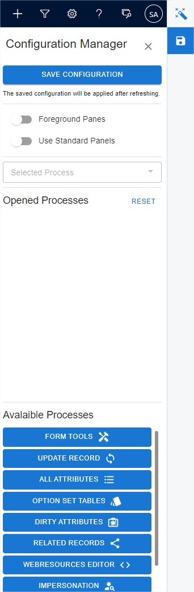

This tool lets you configure which tools automatically open when a page loads. You can also specify a tool to be expanded by default.

A "foreground" option is available to disable automatic width adjustments of the main Dynamics screen.

